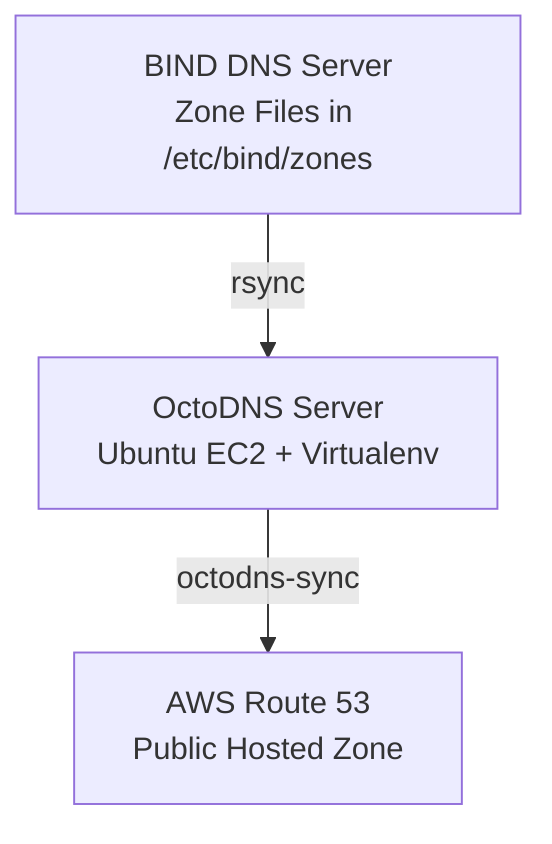

---

# 🧠 OctoDNS Setup: BIND as Source, Route 53 as Target

This guide sets up **OctoDNS** to read DNS records from a BIND server and sync them to an AWS Route 53 Hosted Zone. It includes a detailed architecture flow, automation, and infrastructure setup options.

---

## 📌 Architecture Diagram (Flowchart)



---

## ✅ GitHub-Ready README

### OctoDNS: Sync BIND → AWS Route 53

#### Overview
Sync DNS records from a BIND server (on-prem or EC2) to Route 53 using OctoDNS.

---

### 🔧 Requirements
- Python 3.8+
- Virtualenv
- octodns, octodns-bind, octodns-route53
- rsync + ssh access to BIND

---

### 📁 Directory Structure
```
/home/ubuntu/
├── octodns-venv/
├── octodns-config/
│   ├── config.yaml
│   └── zones/
│       └── db.example.internal
├── us-east-1.pem
└── sync_dns.sh
```

---

### 🛠️ Setup Instructions

#### 1. Install OctoDNS & Plugins
```bash
sudo apt install python3-venv rsync
python3 -m venv octodns-venv
source octodns-venv/bin/activate
pip install octodns octodns-bind octodns-route53
```

#### 2. Rsync BIND Zone Files
```bash
rsync -avz -e "ssh -i /home/ubuntu/us-east-1.pem" \
  ubuntu@<BIND_IP>:/etc/bind/zones/ /home/ubuntu/zones/
```

#### 3. config.yaml
```yaml
providers:
  bind:
    class: octodns_bind.BindProvider
    directory: /home/ubuntu/zones

  route53:
    class: octodns_route53.Route53Provider
    access_key_id: YOUR_AWS_ACCESS_KEY
    secret_access_key: YOUR_AWS_SECRET_KEY

zones:
  example.internal.:
    sources:
      - bind
    targets:
      - route53
```

#### 4. Run Sync
```bash
source ~/octodns-venv/bin/activate
octodns-sync --config-file=/home/ubuntu/octodns-config/config.yaml --doit
```

#### 5. Automate with Cron
```bash
crontab -e
*/10 * * * * /home/ubuntu/sync_dns.sh >> /home/ubuntu/dns_sync.log 2>&1
```

---

## ⚙️ sync_dns.sh
```bash
#!/bin/bash
source /home/ubuntu/octodns-venv/bin/activate
rsync -avz -e "ssh -i /home/ubuntu/us-east-1.pem" ubuntu@<BIND_IP>:/etc/bind/zones/ /home/ubuntu/zones/
octodns-sync --config-file=/home/ubuntu/octodns-config/config.yaml --doit
```

---

## 🧰 Terraform + Ansible (Infra as Code)

### Terraform (ec2.tf)
```hcl
resource "aws_instance" "octodns" {
  ami           = "ami-xxxxxx"
  instance_type = "t3.micro"
  key_name      = "your-key"

  tags = {
    Name = "octodns-sync"
  }

  provisioner "remote-exec" {
    inline = [
      "sudo apt update",
      "sudo apt install -y python3-pip python3-venv rsync"
    ]
  }
}
```

### Ansible Playbook (octodns.yml)
```yaml
- hosts: octodns
  become: yes
  tasks:
    - name: Create virtualenv and install OctoDNS
      shell: |
        python3 -m venv /home/ubuntu/octodns-venv
        source /home/ubuntu/octodns-venv/bin/activate && \
        pip install octodns octodns-bind octodns-route53

    - name: Deploy config.yaml
      copy:
        src: config.yaml
        dest: /home/ubuntu/octodns-config/config.yaml

    - name: Setup cron job
      cron:
        name: "DNS Sync"
        job: "/home/ubuntu/sync_dns.sh >> /home/ubuntu/dns_sync.log 2>&1"
        minute: "*/10"
```

---

✅ **Let me know if you’d like to turn this into a GitHub repo template or generate Terraform/Ansible files separately.**
